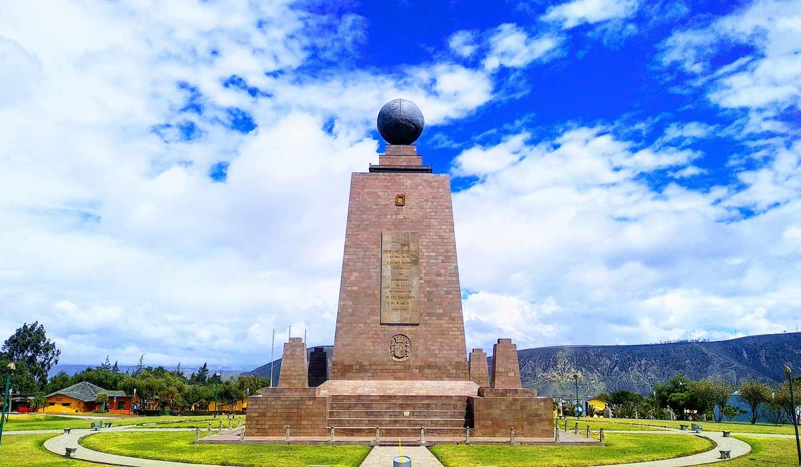

<html>
<head>
	<title>Ciudad Mitad del Mundo</title>
	
</head>
<body>
	
	<h1>Ciudad Mitad del Mundo</h1>
	
		<section>
			<h2>Atracción turística</h2>
			
La Ciudad Mitad del Mundo es un monumento que marca la línea ecuatorial, donde se puede pararse con un pie en cada hemisferio. Es una de las atracciones turísticas más populares de Ecuador.

			
		</section>
		
    <h1>Calculadora de Distancia a la Mitad del Mundo</h1>
    
Su ubicación actual: 

    
Distancia a la mitad del mundo: 

    
</body>
</html>
