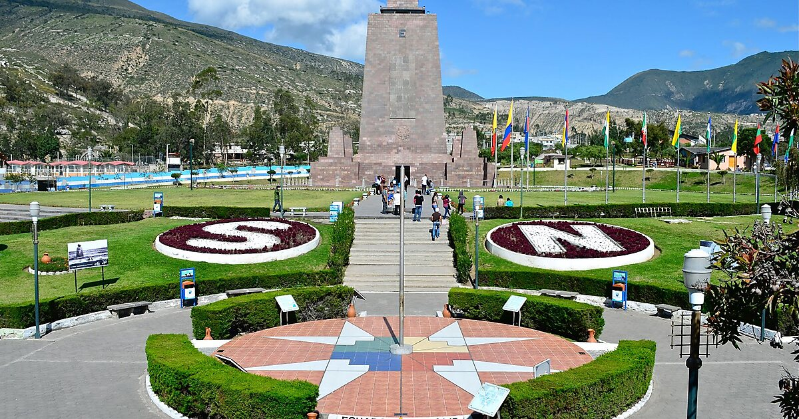

<html>
<head>
	<title>Ciudad Mitad del Mundo</title>
	
</head>
<body>
	
	<h1>Ciudad Mitad del Mundo</h1>
	
		<section>
			<h2>Atracción turística</h2>
			
La Ciudad Mitad del Mundo es un monumento que marca la línea ecuatorial, donde se puede pararse con un pie en cada hemisferio. Es una de las atracciones turísticas más populares de Ecuador.

			
          
          
La principal atracción del lugar es el monumento a la Mitad del Mundo, el cual tiene como finalidad el resaltar la ubicación exacta de la línea ecuatorial, del cual el país toma su nombre, y destacar también la misión geodésica franco-española del siglo XVIII que ubicó el sitio aproximado por el cual pasa la línea equinoccial.
            
También se encuentra el Museo Etnográfico Mitad del Mundo, un museo sobre la etnografía indígena de Ecuador. Una pequeña ciudad que rodea el monumento actúa como centro turístico, ofreciendo una réplica de una ciudad colonial española llamada "Ciudad Mitad del Mundo".

			
		</section>
		
    <h1>Calculadora de Distancia a la Mitad del Mundo</h1>
    
Su ubicación actual:

  	

  
    
Distancia a la mitad del mundo:

  	

    
</body>
</html>
